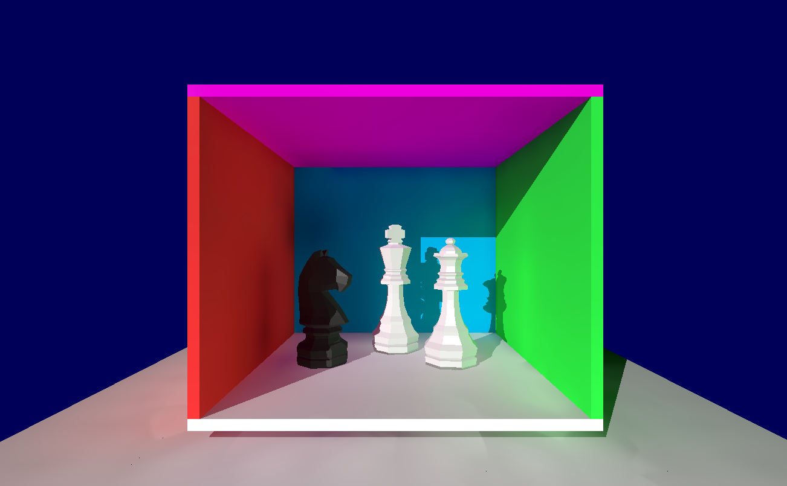
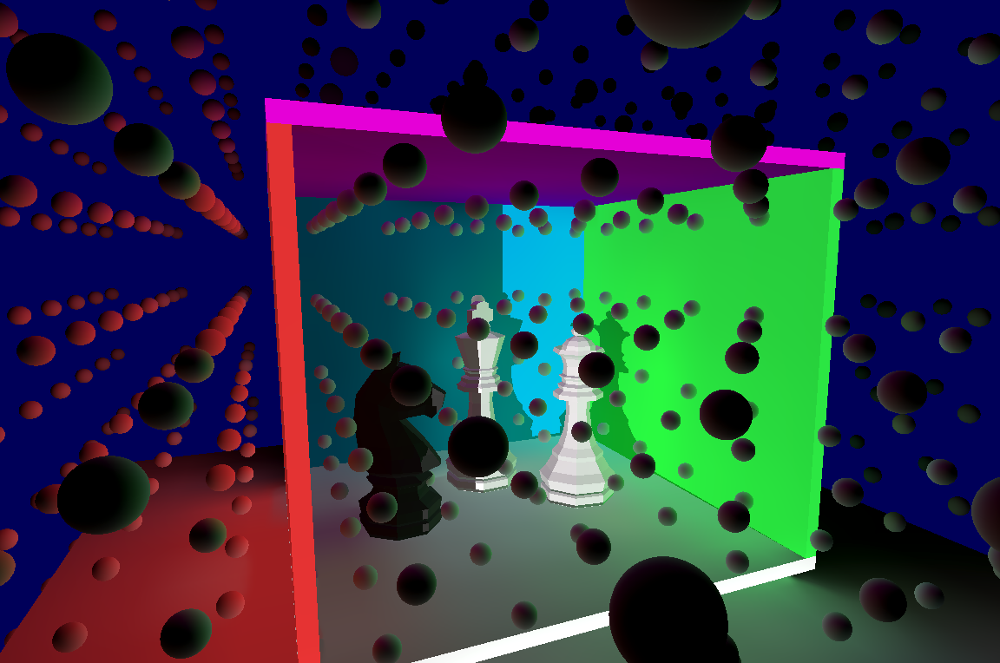

# Unity-DDGI

Unity implementation of Dynamic Diffuse Global Illumination (DDGI).

## Tech

```hlsl
Engine: Unity
Language: C# + HLSL
Rendering: Compute shaders
Technique: DDGI probe-based GI
```

## Features

- Raytraced irradiance probe updates
- Probe border operations for seamless sampling
- Visibility and irradiance texture management
- Rasterized and raytraced rendering paths
- Bilinear interpolation for probe sampling



## Implementation

Multiple compute shaders handle different stages:
- `DDGIComputeRays.compute` - Ray generation
- `DDGIUpdateIrradianceProbes.compute` - Probe updates
- `ProbesBorderOperations.compute` - Border handling
- `DDGIRaytracedRendering.compute` - Final rendering

## Status

> [!WARNING]
> Development at a stall, significant light leaks remain to fix

## References

Based on [Sebastian Lague's Ray Tracing tutorial](https://youtu.be/Qz0KTGYJtUk).
Original implementation demonstrates GPU-accelerated path tracing in Unity using compute shaders.

And for the DDGI part, on NVIDIA's DDGI technique for real-time global illumination.
